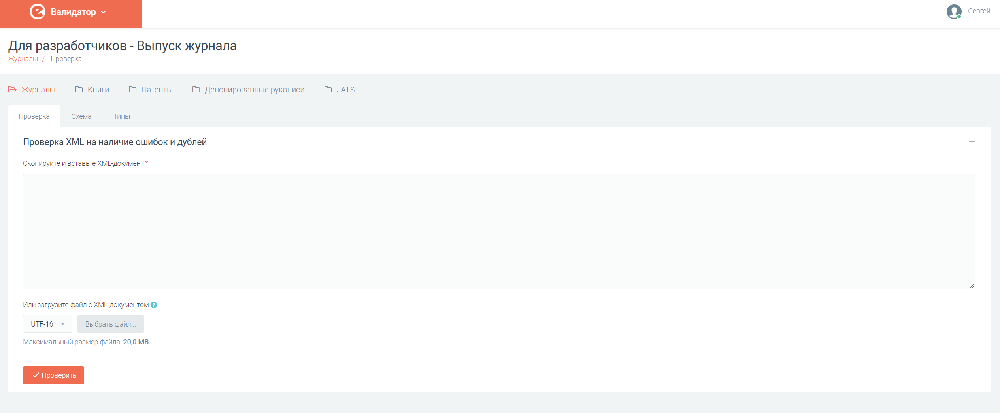
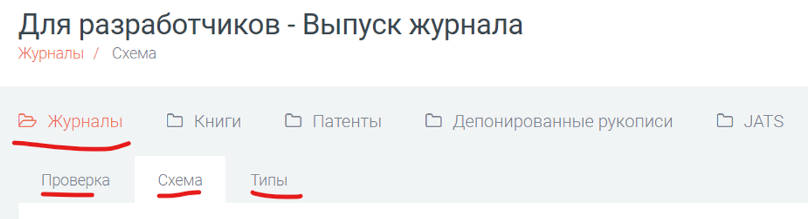

Сервис Валидатор позволяет проверять в формате XML следующие типы изданий:

* Выпуски журналов
* Книги и сборники статей
* Патенты
* Депонированные рукописи

При переходе на сайт [Валидатора](https://validator.elibrary.ru/) вы автоматически переходите на страницу [проверки выпуска журнала](https://validator.elibrary.ru/Journals/Validation)

Каждый тип издания представляет собой раздел. Для каждого раздела доступны три вкладки:

* Проверка - позволяет проверить XML на наличие ошибок. Проверяется следующее:
    + Проверка на соответствие спецификации НЭБ XML (проверяется xml на соответствие XSD-схеме)
    + Проверка самих данных
    + Проверка на дубль. Проверяется, что такой публикации нет в БД НЭБ.
* Схема - позволяет посмотреть структуру XML-документа, а также скачать XSD-схему.
* Типы - содержит справочную информацию. Например справочник типов статей.

