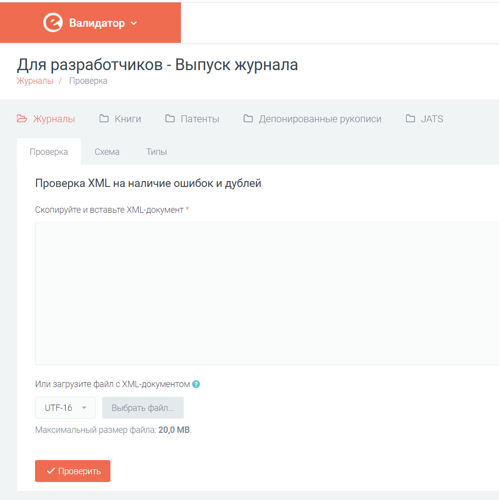
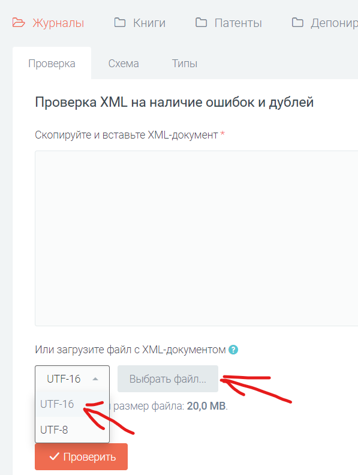
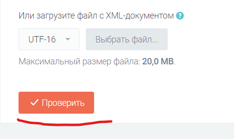

# Журналы

 Для раздела "Журналы" доступны три вкладки:

* [Проверка](https://validator.elibrary.ru/Journals/Validation) - позволяет проверить XML на наличие ошибок. Проверяется следующее:
    + Проверка на соответствие спецификации НЭБ XML (проверяется xml на соответствие XSD-схеме)
    + Проверка самих данных
    + Проверка на дубль. Проверяется, что такой публикации нет в БД НЭБ.
    
    Вставить XML для проверки можно двумя способами:
      - Открыть XML в блокноте или Notepad++, затем скопировать XML и вставить его в поле.
      - Загрузить файл, нажав на кнопку загрузить файл, после этого нужно выбрать кодировку файла (UTF-16 или UTF-8)
       
    После того, как xml появится в текстовом поле, нажать кнопку "Проверить"
    
* Схема - позволяет посмотреть структуру XML-документа, а также скачать XSD-схему.
* Типы - содержит справочную информацию. Например справочник типов статей.

